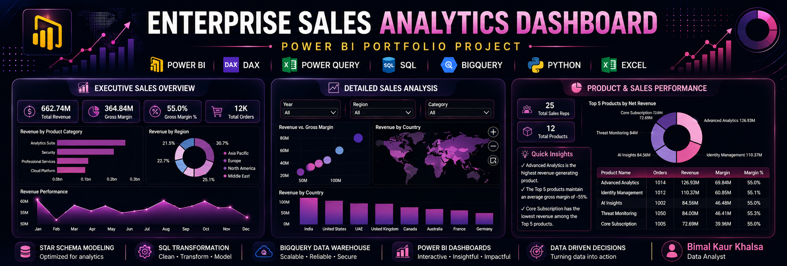
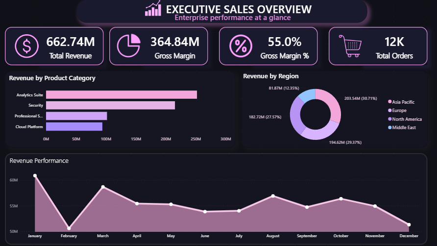
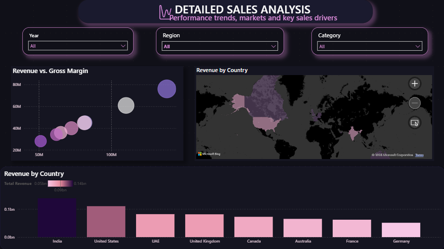
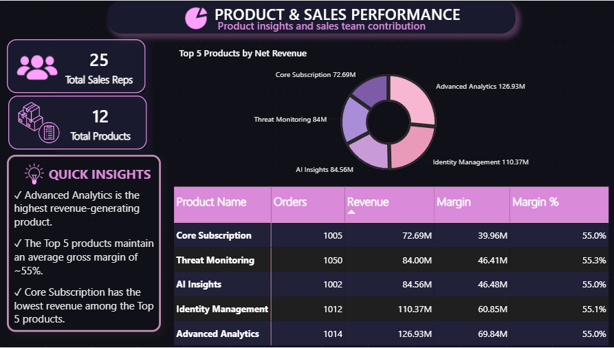

<div align="center">

# 📊 Enterprise Sales Analytics Dashboard

### POWER BI PORTFOLIO PROJECT

An end-to-end Business Intelligence solution built using **Power BI, SQL, BigQuery, Power Query, DAX, Excel, and Python** to analyze enterprise sales performance, profitability, regional trends, and product insights.




</div>

---

# 📌 Project Overview

This project demonstrates the complete Business Intelligence lifecycle—from raw sales data to executive-ready dashboards.

The solution integrates **SQL**, **BigQuery**, **Power Query**, **DAX**, **Excel**, and **Python** to transform raw transactional data into meaningful business insights through an interactive Power BI report.

The dashboard enables business users to monitor sales performance, evaluate profitability, compare regional contributions, and identify top-performing products using modern executive-style visualizations.

---
## 🏗️ Project Architecture

```text
                Raw Data (CSV)
                       │
                       ▼
        Python Data Generation & Processing
                       │
                       ▼
         SQL Cleaning & Transformation (ETL)
                       │
                       ▼
      Star Schema Data Modeling (Fact & Dimensions)
                       │
                       ▼
         BigQuery Data Warehouse
                       │
                       ▼
         Power BI Data Modeling & DAX
                       │
                       ▼
     Interactive Executive Dashboard
                       │
                       ▼
          Business Insights & Decision Making
```

# 📊 Dashboard Preview

## 1️⃣ Executive Sales Overview



### Highlights

- Executive KPI Summary
- Revenue Performance Trend
- Revenue by Product Category
- Revenue by Region
- Interactive Executive Dashboard

---

## 2️⃣ Detailed Sales Analysis



### Highlights

- Revenue vs Gross Margin Analysis
- Geographic Sales Distribution
- Country-wise Revenue Comparison
- Interactive Filters
- Regional Performance Analysis

---

## 3️⃣ Product & Sales Performance



### Highlights

- Top Performing Products
- Product Revenue Distribution
- Sales Representative Overview
- Product Performance Matrix
- Executive Business Insights

---

# 📈 Executive KPIs

- 💰 Total Revenue
- 📊 Gross Margin
- 📈 Gross Margin %
- 🛒 Total Orders
- 👥 Total Sales Representatives
- 📦 Total Products

---

# 💡 Key Business Insights

- Advanced Analytics generated the highest revenue among all products.
- Identity Management ranked second in overall revenue contribution.
- Average Gross Margin across Top 5 products remained approximately **55%**.
- India contributed the highest revenue among all countries.
- Revenue remained relatively stable throughout the year with seasonal fluctuations.
- Product performance can be monitored using interactive drill-down visuals and filters.

---

# ⚙️ Features

- Interactive Dashboard Navigation
- Executive KPI Cards
- Modern Dark UI Theme
- Interactive Slicers
- Dynamic DAX Measures
- Geographic Analysis
- Product Performance Tracking
- Regional Sales Analysis
- Business Insight Cards
- Executive Summary Layout

---

# 🏗 Data Model

This dashboard follows a **Star Schema** architecture for optimized reporting performance.

### Fact Table

- fact_sales

### Dimension Tables

- dim_product
- dim_customer
- dim_region
- dim_sales_rep
- dim_date

Benefits

- Faster Queries
- Better Relationships
- Scalable Model
- Enterprise BI Design

---

# ⚡ Power Query

Power Query was used for:

- Data Cleaning
- Removing Duplicates
- Data Type Conversion
- Handling Missing Values
- Data Transformation
- Table Preparation

---

# 📊 DAX Measures

Key DAX calculations include:

- Total Revenue
- Gross Margin
- Gross Margin %
- Total Orders
- Total Products
- Total Sales Representatives
- Average Order Value
- Dynamic KPI Measures

---

# 🗄 SQL Workflow

SQL was used to:

- Explore Sales Data
- Aggregate Revenue
- Product Performance Analysis
- Regional Analysis
- Customer Analysis
- Data Validation

---

# ☁ BigQuery

Google BigQuery was used for:

- Cloud Data Storage
- Analytical Queries
- Large Dataset Processing
- Business Intelligence Pipeline

---

# 🐍 Python

Python was used for:

- Data Exploration
- Data Cleaning
- Exploratory Data Analysis
- Supporting Analytics Workflow

---

# 🛠 Tech Stack

| Technology | Purpose |
|------------|---------|
| Power BI | Dashboard Development |
| DAX | Business Calculations |
| Power Query | Data Transformation |
| SQL | Data Analysis |
| BigQuery | Cloud Analytics |
| Python | Data Processing |
| Excel | Source Dataset |

---

# 📂 Project Structure

```
Enterprise-Sales-Analytics-Dashboard
│
├── assets
│   └── banner.png
│
├── data
│
├── docs
│
├── powerbi
│   └── Enterprise_Sales_Analytics_Dashboard.pbix
│
├── python
│
├── screenshots_
│   ├── Executive_Overview.png
│   ├── Detailed_Sales_Analysis.png
│   └── Product_Sales_Performance.png
│
├── sql
│
├── README.md
│
├── LICENSE
│
└── .gitignore
```

---

# 🚀 Future Enhancements

- Forecasting Analysis
- Time Intelligence KPIs
- Drill-through Pages
- Dynamic Tooltips
- Mobile Dashboard Layout
- Role-Level Security (RLS)
- Incremental Refresh
- Deployment to Power BI Service

---

# 👩‍💻 About Me

**Bimal Kaur Khalsa**

Aspiring Data Analyst passionate about transforming raw data into meaningful business insights using modern Business Intelligence tools.

### Skills

- Power BI
- SQL
- Python
- BigQuery
- Power Query
- DAX
- Excel
- Data Visualization
- Business Intelligence

---

# 🤝 Connect With Me


- 📧 Email: **bimalkkpanesar@gmail.com**

---

# 📄 # 📄 License

This project is licensed under the **MIT License**. See the [LICENSE](LICENSE) file for details.

---

<div align="center">

### ⭐ If you found this project useful, consider giving it a Star!

Made with ❤️ using Power BI

</div>
