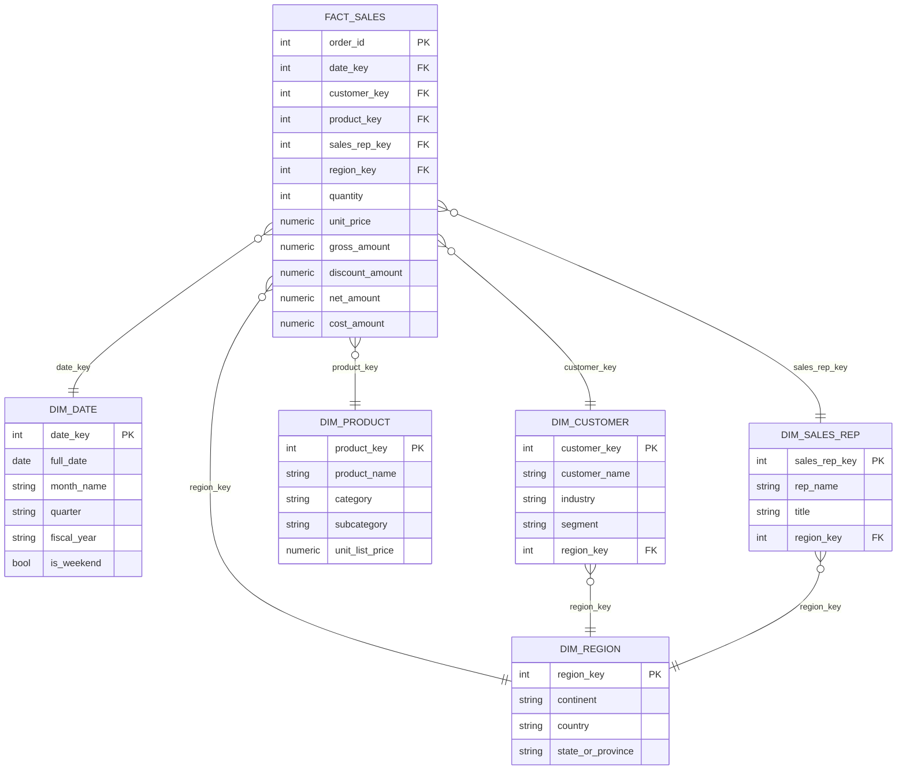

# Star Schema — Entity Relationship Diagram

GitHub renders Mermaid diagrams natively in markdown, so this shows up as a
diagram directly on the repo page — no image export needed.

## Why a star schema (not a normalized OLTP model)

- **One join hop** from fact to any dimension → fast, predictable Power BI
  query plans and simple DAX (no bidirectional filtering hacks).
- **Conformed dimensions** (`dim_region` shared by both customer and rep)
  let you slice revenue-by-region and rep-performance-by-region with the
  same filter context.
- **Grain is explicit**: one row in `fact_sales` = one order line. Every
  measure in the DAX library is built assuming that grain — documented so
  nobody double-counts by accident.
